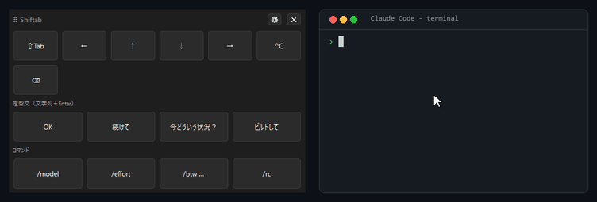
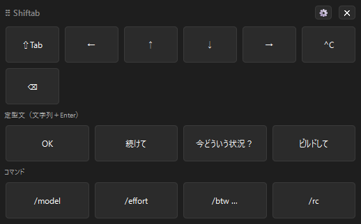
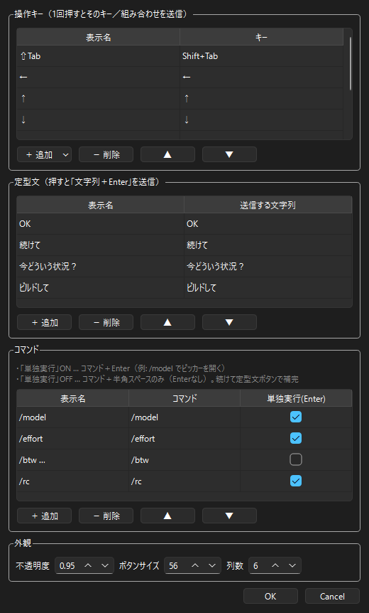
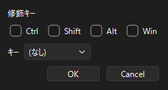

# Shiftab

**Claude Code を“押すだけ”で操作する、Windows 用フローティングキーボード。** 画面の最前面に浮かぶ小さなバーで、よく使うキーや定型文をワンクリック送信。Windows 標準のスクリーンキーボード（osk.exe）と違い、押してもターミナルのフォーカスを奪いません。




## Shiftab とは

Claude Code をターミナルで使うとき、`Shift+Tab` やスラッシュコマンド、定型の返事を何度も打つ場面があります。Shiftab はそれらを並べた小さなバーを画面の隅に常駐させ、**ボタンを押すだけ**で裏のターミナルへ送ります。キーボードから手を離さずに済む人にも、毎回のタイプを減らしたい人にも向いています。

## なぜ Shiftab か

- **フォーカスを奪わない** — バーをクリックしてもターミナルは入力待ちのまま。送ったキーはそのまま Claude Code に届きます。
- **打ち間違い・繰り返しを減らす** — 「OK」「進めて」などの定型文や `/model` などのコマンドを一発送信。
- **自分仕様に並べ替えられる** — 表示するキーを候補から選ぶ／カスタムで組み立てる（例: Ctrl+Shift+P）／不要なキーを消す／順番を入れ替える。
- **日本語入力でも安心** — 送信中だけ送信先の IME を自動オフにし、文字化けや誤確定を防ぎます。
- **インストール不要で配布** — exe をダウンロードして起動するだけ。Python は要りません。

## スクリーンショット

| フローティングバー | 設定画面 | キーのカスタマイズ |
|---|---|---|
|  |  |  |

## ダウンロード

最新版は [Releases](https://github.com/hiperjack/Shiftab/releases) から入手できます。

| OS | 形式 |
|---|---|
| Windows 10 / 11 | `Shiftab-vX.Y.Z.zip`（展開して `Shiftab.exe` を起動） |

> **初回起動時の警告について**: 配布 exe は未署名のため、Windows SmartScreen が「WindowsによってPCが保護されました」と表示することがあります。`詳細情報` → `実行` で起動できます。

## 使い方の基本

1. `Shiftab.exe` を起動すると、バーが画面の最前面に表示されます。
2. タイトル部分（⠿ Shiftab）をドラッグして好きな位置へ移動できます（位置は保存されます）。
3. Claude Code のターミナルを開いた状態でボタンを押すと、そのターミナルへキーが届きます。
4. 右上の **⚙** で設定画面を開き、操作キー・定型文・コマンド・外観を編集できます。
5. 右上の **✕** で終了します。

## よく使う操作

| ボタン | 送信される内容 |
|---|---|
| ⇧Tab | Shift+Tab（モード切替など） |
| ←↑↓→ | カーソル移動（`/model` のピッカー選択など） |
| ⌃C | Ctrl+C（実行中の処理を中断） |
| 定型文 | 文字列 ＋ Enter（例: OK / 進めて） |
| コマンド | スラッシュコマンド送信（Enter あり／なしを選択可） |

操作キーの追加・並び替え、コマンドの細かい挙動、トークンの一覧などは [docs/architecture.md](./docs/architecture.md) を参照してください。

## ソースからビルドする

**必要なもの:** Windows 10 / 11、Python 3.10 以降

```sh
pip install -r requirements.txt
python main.py                      # ソースから直接起動

pip install pyinstaller             # exe を作る場合
pyinstaller --noconfirm Shiftab.spec
```

`dist\Shiftab.exe` が生成されます。詳細は [docs/architecture.md](./docs/architecture.md#ソースからビルドするexe-化) を参照。

## 技術スタック

| 層 | 採用技術 |
|---|---|
| 言語 | Python 3.10+ |
| GUI | PySide6（Qt for Python） |
| キー送出 | Win32 `SendInput` / `WM_IME_CONTROL`（ctypes） |
| 配布 | PyInstaller（単一 exe） |

設計・内部実装の詳細は [docs/architecture.md](./docs/architecture.md) に記載しています。

## ライセンス

[MIT License](./LICENSE)
